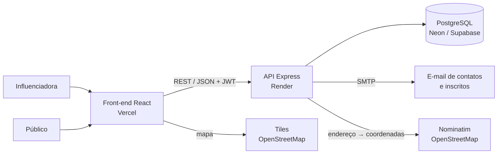
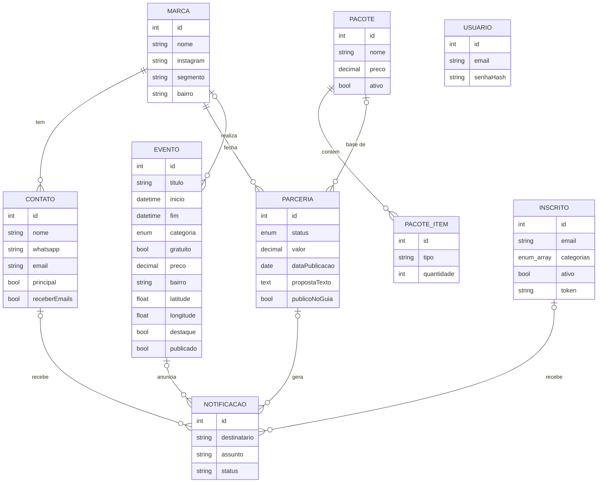

# Guia Joinville

Plataforma que reúne **todos os eventos de Joinville em um só lugar** e dá à influenciadora que faz a curadoria
um painel para gerenciar marcas parceiras, propostas e a agenda.
Projeto desenvolvido no **Hackathon Girls with Incode 2026** (Católica de Joinville) para o
[@guiagastronomicojoinville](https://www.instagram.com/guiagastronomicojoinville/).

> 📐 Arquitetura detalhada, estrutura de pastas e guia completo de execução: [docs/ARQUITETURA.md](docs/ARQUITETURA.md)

## O problema

**Para o público:** as informações sobre o que fazer na cidade estão espalhadas em vários perfis e sites, muita
gente só descobre um evento depois que ele aconteceu, e faltam detalhes básicos (horário, preço, endereço).

**Para a influenciadora:** as parcerias com restaurantes e marcas são fechadas pelo Instagram, e contatos,
valores e datas ficam espalhados entre DMs, WhatsApp e anotações.

## A solução

### Site público (a agenda)

| Funcionalidade | Resposta da pesquisa com o público |
|---|---|
| Agenda única com busca | "As informações estão espalhadas em vários perfis/sites" |
| Filtros rápidos **Hoje / Amanhã / Fim de semana / 7 dias** | Filtro por data foi listado como essencial |
| Filtro por **categoria**, **bairro** e **só gratuitos** | Filtro por categoria; preço e localização decidem a saída |
| **Mapa interativo** (OpenStreetMap) | Mapa com eventos próximos |
| Botão **Comprar ingresso** | Link direto para ingressos |
| **Favoritos** (sem precisar de conta) e **alertas por e-mail** por categoria | Salvar favoritos / receber alertas; "descubro os eventos depois que aconteceram" |
| Card com data, hora, local e preço visíveis de cara | "Falta de detalhes (horários, preços, endereço)" |
| Selo **Recomendado pelo Guia** | "Dificuldade para saber o que é bom" |
| Como chegar, adicionar ao Google Agenda e compartilhar no WhatsApp | Companhia é fator de decisão ("chamar a turma") |

### Cadastro das marcas (`/parceiros`)

A **própria marca interessada** se cadastra pelo botão **Seja parceiro**: informa os dados do negócio e do
contato, escolhe um dos pacotes da influenciadora (ou pede proposta personalizada) e pode sugerir um evento.
A proposta chega na hora no e-mail da marca, a parceria aparece no kanban com o selo "via site" e a
influenciadora é avisada por e-mail.

### Painel da influenciadora (`/admin`, sem link no site)

| Funcionalidade | O que resolve |
|---|---|
| **Eventos**: cadastro com rascunho, destaque e localização automática no mapa | Alimentar a agenda sem depender de desenvolvedor |
| **Cadastro de marcas e contatos** com busca e filtros por bairro e segmento | Encontrar qualquer informação em segundos |
| **Pacotes dinâmicos** criados pela própria influenciadora (itens, quantidades e preço) | Padronizar o que é oferecido sem depender de desenvolvedor |
| **Proposta gerada automaticamente** a partir da marca e do pacote, com prévia ao vivo | Proposta pronta em um clique, para copiar ou mandar no WhatsApp |
| **Kanban de parcerias** (Prospecção → Negociando → Fechado → Publicado → Pago) | Saber em que pé está cada parceria |
| **E-mails automáticos** para os contatos da marca: cadastro, proposta e cada mudança de etapa | A marca acompanha tudo sem precisar perguntar |
| **Painel** com eventos na agenda, inscritos, valores a receber e próximas publicações | Visão do negócio num só lugar |

### E-mails automáticos

| Quem recebe | Quando |
|---|---|
| Contato da marca | Cadastro da marca, nova proposta, cada mudança de etapa da parceria |
| Influenciadora | Cada marca que se cadastra pelo site |
| Público inscrito | Confirmação da inscrição e cada novo evento publicado nas categorias de interesse (com link para descadastrar) |

## Arquitetura



O back-end segue **MVC em camadas**, com separação clara de responsabilidades:

```
backend/src
├── routes/        rotas HTTP e quais exigem login
├── controllers/   recebem a requisição, validam a entrada e devolvem a resposta
├── services/      regras de negócio (uma classe por domínio)
├── views/         templates dos e-mails
├── validators/    schemas Zod (validação e tipos)
├── middlewares/   autenticação JWT e tratamento central de erros
├── lib/           Prisma (acesso ao banco) e envio de e-mail
└── config/        variáveis de ambiente
prisma/schema.prisma   modelos (camada Model)
```

O front-end é componentizado: `pages/` (telas), `components/` (UI reutilizável e modais),
`lib/` (cliente da API e formatação) e `contexts/` (sessão).

### Modelo de dados



Decisões de modelagem:
- **`propostaTexto` é uma cópia** do texto enviado: editar um pacote depois não altera propostas antigas.
- Pacote já usado em alguma parceria é **desativado em vez de excluído**, preservando o histórico.
- Valores monetários usam `Decimal(10,2)`, nunca `float`.
- `receberEmails` no contato funciona como opt-in para as notificações.
- Toda tentativa de envio de e-mail é registrada em `Notificacao` (auditoria).
- `Inscrito.categorias` é uma lista de enum do PostgreSQL: vazia significa "quero tudo".
- `Inscrito.token` (UUID) permite descadastrar pelo link do e-mail sem expor o id.
- Os filtros de período usam o horário de Brasília e escondem eventos que já terminaram.
- A localização no mapa é obtida pelo endereço em segundo plano; se falhar, o evento continua na lista.

## Tecnologias

- **Front-end:** React 19, TypeScript, Vite, Tailwind CSS 4, React Router, Leaflet (mapa), Lucide Icons
- **Back-end:** Node.js, Express 5, TypeScript, Zod, JWT, bcrypt, Nodemailer
- **Banco:** PostgreSQL com Prisma ORM 7 (migrations versionadas)
- **Infra:** Docker Compose (banco local), Vercel (front), Render (API), Neon ou Supabase (banco)

## Como rodar localmente

Pré-requisitos: **Node.js 20+** e **Docker** (ou um PostgreSQL próprio).

```bash
# 1. Banco de dados
docker compose up -d

# 2. API
cd backend
cp .env.example .env
npm install
npx prisma migrate deploy
npm run db:seed
npm run dev          # http://localhost:3333/api

# 3. Front-end (em outro terminal)
cd frontend
npm install
npm run dev          # http://localhost:5173
```

- Site público: http://localhost:5173
- Painel da influenciadora: http://localhost:5173/admin (login criado pelo seed, definido em `ADMIN_EMAIL` e `ADMIN_SENHA` no `.env`)

O seed cria eventos com datas relativas ao dia em que roda (hoje, amanhã e o próximo fim de semana), então a
demo sempre tem conteúdo nos filtros rápidos.

**E-mails:** sem SMTP configurado, a API usa uma caixa de teste do [Ethereal](https://ethereal.email).
Os e-mails não chegam de verdade, mas cada um gera um link de visualização, que aparece no terminal e na tela
"E-mails". Para enviar de verdade, preencha as variáveis `SMTP_*` no `.env`.

> Se usar **npm 11 ou mais novo** e a migration falhar por falta do "schema engine", rode
> `npm install-scripts ls` e aprove `prisma`, `@prisma/engines` e `esbuild`. O `package.json` já traz essa
> lista em `allowScripts`.

### Scripts úteis (backend)

| Comando | O que faz |
|---|---|
| `npm run dev` | API com recarga automática |
| `npm run db:migrate` | Cria uma migration após alterar o `schema.prisma` |
| `npm run db:seed` | Popula com dados de exemplo |
| `npm run db:studio` | Abre o Prisma Studio para ver o banco |
| `npm run typecheck` | Checagem de tipos |

## Endpoints principais

| Método | Rota | Descrição |
|---|---|---|
| POST | `/api/auth/login` | Login, devolve o token JWT |
| GET | `/api/publico/pacotes` | Pacotes ativos mostrados no formulário das marcas |
| POST | `/api/publico/parcerias` | Cadastro da marca pelo site (cria marca, parceria e evento sugerido) |
| GET/POST | `/api/marcas` | Lista (com `?busca=&bairro=&segmento=`) e cria marca com contatos |
| GET/PUT/DELETE | `/api/marcas/:id` | Detalhe, edição e exclusão |
| POST | `/api/marcas/:id/contatos` | Adiciona contato (envia e-mail de boas-vindas) |
| GET/POST/PUT/DELETE | `/api/pacotes` | CRUD de pacotes com itens |
| POST | `/api/parcerias/previa` | Gera o texto da proposta sem salvar |
| POST | `/api/parcerias` | Cria a parceria e envia a proposta por e-mail |
| PATCH | `/api/parcerias/:id/status` | Muda a etapa e avisa os contatos |
| GET/POST/PUT/DELETE | `/api/eventos` | CRUD de eventos (avisa inscritos ao publicar) |
| GET | `/api/dashboard` | Indicadores do painel |
| GET | `/api/publico/eventos` | Agenda pública: `?periodo=hoje\|amanha\|fds\|semana&categoria=&bairro=&gratuito=true&busca=` |
| GET | `/api/publico/eventos/:id` | Detalhe de um evento publicado |
| GET | `/api/publico/filtros` | Categorias e bairros com eventos futuros |
| POST | `/api/publico/inscricao` | Inscreve e-mail nos alertas por categoria |
| POST | `/api/publico/descadastrar/:token` | Cancela a inscrição |
| GET | `/api/publico/lugares` | Lugares recomendados (parcerias marcadas para o guia) |

## Deploy

1. **Banco:** crie um PostgreSQL gratuito no [Neon](https://neon.tech) ou no [Supabase](https://supabase.com) e copie a URL.
2. **API no Render:** novo *Web Service* apontando para a pasta `backend`.
   - Build: `npm install && npm run build && npx prisma migrate deploy`
   - Start: `npm start`
   - Variáveis: as do `.env.example`, com `FRONTEND_URL` igual à URL da Vercel.
3. **Front na Vercel:** importe o repositório com *Root Directory* `frontend` e defina `VITE_API_URL`.

## Fluxo de trabalho com Git

- `main`: versão estável (a que vai para a apresentação)
- `develop`: integração do time
- `feature/<nome>`: uma branch por funcionalidade, mergeada em `develop` via Pull Request

Commits no padrão [Conventional Commits](https://www.conventionalcommits.org/pt-br/):
`feat: kanban de parcerias`, `fix: filtro por bairro`, `docs: diagrama ER`, `refactor: ...`.

## Roadmap

- Alertas pelo WhatsApp (API oficial do WhatsApp Business)
- Avaliações e fotos de quem foi ao evento
- "Perto de mim": ordenar por distância usando a localização do celular
- Assistente com IA na agenda ("onde tem rodízio de sushi na zona sul?")
- Contratos e cobrança (Pix) dentro do app

## Equipe

| Nome |
|---|
| ANA BEATRIZ PEDROZO |
| GABRIELI EDUARDA LEMBECK |
| LETÍCIA DE ABREU |
| THUANY CORREA LEITE |