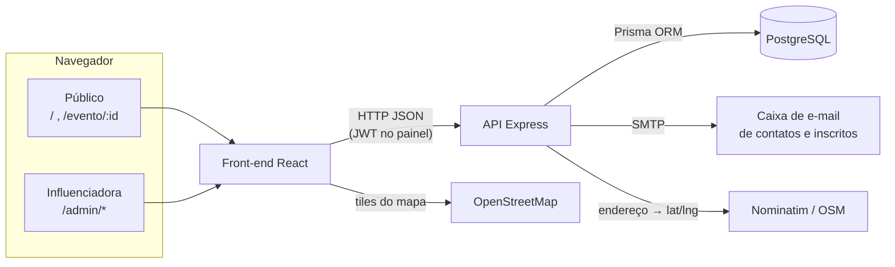
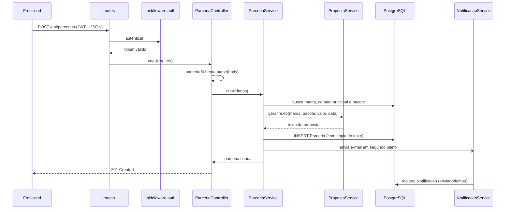
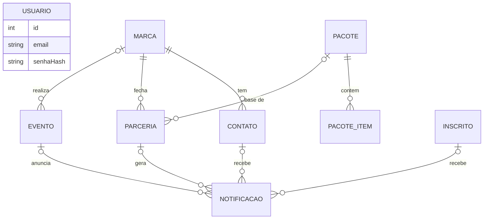
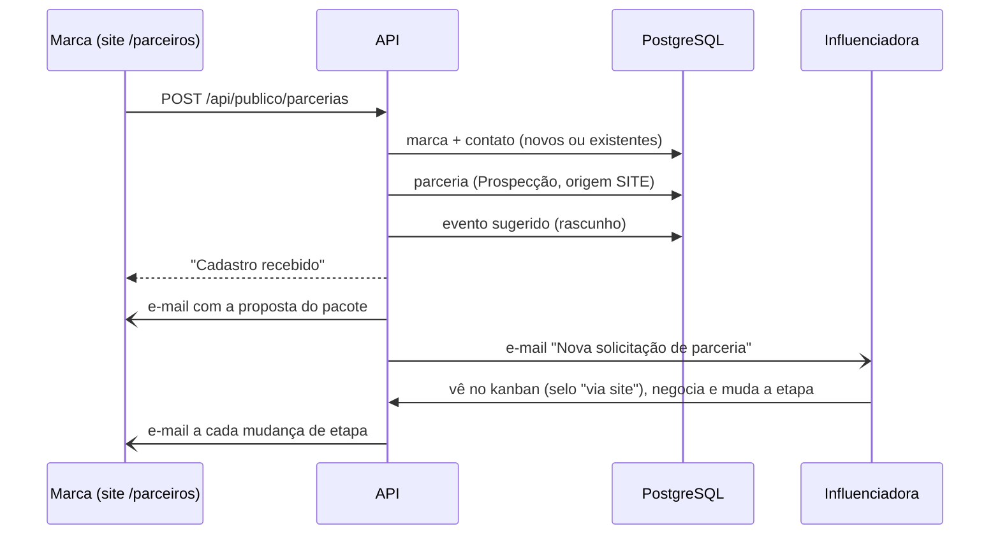
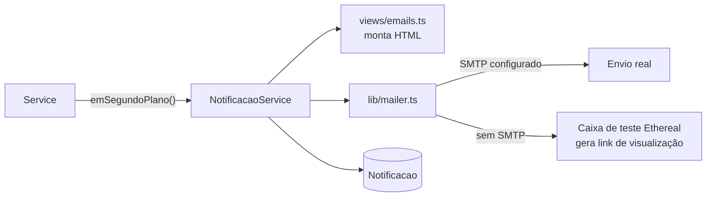

# Arquitetura do Guia Joinville

Este documento explica como o sistema foi construído, o papel de cada pasta e arquivo, os fluxos principais
e como rodar o projeto do zero.

---

## 1. Visão geral

O sistema tem **dois públicos** e é dividido em **duas aplicações** que conversam por uma API REST:

| Aplicação | Pasta | Tecnologia | Quem usa |
|---|---|---|---|
| **Front-end** (SPA) | `frontend/` | React 19 + TypeScript + Vite + Tailwind | Público (agenda em `/`) e influenciadora (painel em `/admin`) |
| **API** | `backend/` | Node.js + Express 5 + TypeScript + Prisma | Chamada apenas pelo front-end |
| **Banco** | (Docker ou nuvem) | PostgreSQL | Acessado apenas pela API |



Princípios usados:

- **Separação de responsabilidades**: rota → controller → service → banco. Cada camada só conhece a de baixo.
- **Validação na borda**: todo dado que entra na API passa por um schema Zod antes de chegar à regra de negócio.
- **Tipagem de ponta a ponta**: TypeScript no front e no back; o Prisma gera os tipos a partir do schema do banco.
- **Tarefas lentas fora da resposta HTTP**: envio de e-mail e geolocalização rodam em segundo plano, então a tela não trava.

---

## 2. Estrutura de pastas

```
guia-parcerias/
├── README.md                     Apresentação do projeto, endpoints e deploy
├── docker-compose.yml            Sobe o PostgreSQL local
├── .gitignore
├── docs/
│   └── ARQUITETURA.md            Este documento
│
├── backend/                      API REST (Node + Express + Prisma)
│   ├── package.json              Dependências e scripts (dev, build, db:*)
│   ├── tsconfig.json             Configuração do TypeScript
│   ├── prisma.config.ts          Onde estão o schema, as migrations e o seed
│   ├── .env.example              Modelo das variáveis de ambiente
│   ├── prisma/
│   │   ├── schema.prisma         MODELO: tabelas, relações e enums
│   │   ├── seed.ts               Dados de exemplo (marcas, pacotes, eventos)
│   │   └── migrations/           Histórico versionado de alterações no banco (SQL)
│   │       ├── 20260929000000_init/                 Usuários, marcas, contatos, pacotes, parcerias
│   │       └── 20260930000000_eventos_inscritos/    Eventos e inscritos
│   └── src/
│       ├── server.ts             Sobe o servidor HTTP
│       ├── app.ts                Monta o Express: CORS, JSON, rotas e tratador de erros
│       ├── config/env.ts         Lê e valida as variáveis de ambiente
│       ├── routes/index.ts       ROTAS: URL + método → controller; separa públicas e protegidas
│       ├── middlewares/
│       │   ├── auth.ts           Valida o token JWT do painel
│       │   └── errorHandler.ts   Converte erros em respostas HTTP padronizadas
│       ├── controllers/          CONTROLLERS: leem a requisição, validam e chamam o service
│       │   ├── MarcaController.ts
│       │   ├── ContatoController.ts
│       │   ├── PacoteController.ts
│       │   ├── ParceriaController.ts
│       │   ├── EventoController.ts
│       │   └── GeralController.ts        Auth, Dashboard, Notificações e rotas públicas
│       ├── services/             SERVICES: regras de negócio (uma classe por domínio)
│       │   ├── auth.service.ts           Login e emissão do JWT
│       │   ├── marca.service.ts          Marcas, busca e filtros
│       │   ├── contato.service.ts        Contatos e contato principal
│       │   ├── pacote.service.ts         Pacotes dinâmicos e seus itens
│       │   ├── parceria.service.ts       Parcerias, proposta e mudança de etapa
│       │   ├── proposta.service.ts       Monta o texto da proposta
│       │   ├── evento.service.ts         Eventos, filtros de período e geolocalização
│       │   ├── publico.service.ts        Tudo que o público acessa sem login
│       │   ├── notificacao.service.ts    Envia e registra e-mails
│       │   └── dashboard.service.ts      Indicadores do painel
│       ├── views/emails.ts       VIEW: templates HTML/texto dos e-mails
│       ├── validators/schemas.ts Schemas Zod (validação + tipos de entrada)
│       ├── lib/
│       │   ├── prisma.ts         Conexão única com o banco
│       │   ├── mailer.ts         Envio de e-mail (SMTP real ou caixa de teste)
│       │   ├── periodo.ts        Cálculo de "hoje", "amanhã", "fim de semana" no fuso de Brasília
│       │   └── geocode.ts        Endereço → latitude/longitude (Nominatim)
│       ├── errors/AppError.ts    Erro de negócio com código HTTP
│       └── generated/            Cliente Prisma gerado automaticamente (não versionado)
│
└── frontend/                     SPA React
    ├── package.json
    ├── vite.config.ts            Plugins e proxy /api → localhost:3333 em desenvolvimento
    ├── vercel.json               Faz todas as rotas caírem no index.html em produção
    ├── index.html
    ├── .env.example              VITE_API_URL (só produção)
    └── src/
        ├── main.tsx              Ponto de entrada
        ├── App.tsx               Mapa de rotas (público e /admin)
        ├── index.css             Tailwind e cores da marca
        ├── types.ts              Tipos das entidades que vêm da API
        ├── contexts/
        │   └── AuthContext.tsx   Sessão da influenciadora (login/logout)
        ├── lib/
        │   ├── api.ts            Cliente HTTP: base URL, token, tratamento de erro
        │   ├── formato.ts        Moeda, datas, categorias, links (Maps, Agenda, WhatsApp)
        │   ├── useCarregar.ts    Hook genérico de busca de dados (loading/erro/recarregar)
        │   └── useFavoritos.ts   Favoritos salvos no navegador
        ├── components/
        │   ├── ui.tsx            Biblioteca de UI: Botão, Campo, Modal, Cartão, Selo...
        │   ├── Layout.tsx        Menu lateral do painel
        │   ├── MarcaFormModal.tsx, NovaParceriaModal.tsx, ParceriaModal.tsx,
        │   ├── EventoFormModal.tsx, PropostaAcoes.tsx
        │   └── publico/
        │       ├── LayoutPublico.tsx   Cabeçalho e rodapé do site
        │       ├── CartaoEvento.tsx    Card do evento, capa e botão de favorito
        │       ├── MapaEventos.tsx     Mapa Leaflet (carregado sob demanda)
        │       └── Inscricao.tsx       Formulário de alertas por e-mail
        └── pages/
            ├── publico/
            │   ├── Agenda.tsx          Página inicial com filtros, lista e mapa
            │   ├── EventoDetalhe.tsx   Página do evento
            │   └── Descadastrar.tsx    Cancela a inscrição pelo link do e-mail
            ├── Login.tsx
            ├── Painel.tsx          Indicadores
            ├── Eventos.tsx         Gestão da agenda
            ├── Marcas.tsx, MarcaDetalhe.tsx
            ├── Parcerias.tsx       Kanban
            ├── Pacotes.tsx         Pacotes dinâmicos
            └── Notificacoes.tsx    Histórico de e-mails
```

---

## 3. Back-end em detalhes

### 3.1 Camadas (MVC)

| Camada | Onde | Responsabilidade | Não faz |
|---|---|---|---|
| **Rotas** | `routes/index.ts` | Liga URL + método ao controller; aplica `autenticar` nas rotas do painel | Regra de negócio |
| **Controller** | `controllers/*` | Lê `params`, `query` e `body`, valida com Zod, chama o service e devolve o status HTTP | Acessar o banco |
| **Service** | `services/*` | Regras de negócio, transações, disparo de e-mails | Conhecer `req`/`res` |
| **Model** | `prisma/schema.prisma` + `lib/prisma.ts` | Estrutura dos dados e acesso ao banco | — |
| **View** | `views/emails.ts` | Apresentação dos e-mails (HTML e texto) | — |

Os services são **classes** com uma instância exportada (`export const marcaService = new MarcaService()`).
Isso deixa as dependências explícitas e facilita trocar ou testar uma peça isoladamente.

### 3.2 Ciclo de uma requisição

Exemplo: a influenciadora cria uma proposta (`POST /api/parcerias`).



### 3.3 Tratamento de erros

Todos os erros sobem até `middlewares/errorHandler.ts` (o Express 5 já repassa erros de funções `async`):

| Origem | Resposta |
|---|---|
| `AppError` (regra de negócio) | Código definido no erro (400, 401, 404) + `{ erro }` |
| `ZodError` (validação) | `400` + `{ erro: "Dados inválidos", detalhes: [{ campo, mensagem }] }` em português |
| Prisma `P2025` (registro não existe) | `404` |
| Qualquer outro | `500` e log no terminal |

### 3.4 Autenticação e segurança

- Login com e-mail e senha; a senha fica no banco como **hash bcrypt**.
- O login devolve um **JWT** válido por 8 horas; o front envia `Authorization: Bearer <token>`.
- **O login da influenciadora não aparece no site**: não há botão nem link. Ela acessa digitando `/admin`
  no navegador (sem sessão, é levada ao login). A conta é criada pelo seed (`ADMIN_EMAIL` / `ADMIN_SENHA`).
- **Quem se cadastra pelo site são as marcas**, na página pública `/parceiros` (ver 3.6). Elas não ganham
  login; acompanham a parceria pelos e-mails automáticos.
- O formulário das marcas tem um campo invisível (*honeypot*): se vier preenchido, é robô, e a API responde
  "sucesso" sem gravar nada.
- As rotas `/api/publico/*` e `/api/auth/login` são abertas; todas as outras exigem token.
- As rotas públicas **nunca** devolvem valores de parceria nem dados de contato.
- **CORS** restrito às origens em `FRONTEND_URL`.
- Conteúdo digitado é **escapado** antes de entrar no HTML dos e-mails.
- O descadastro usa um **token UUID** em vez do id, para ninguém cancelar a inscrição de outra pessoa.

### 3.5 Modelo de dados



| Tabela | Para que serve | Campos importantes |
|---|---|---|
| `Usuario` | Login do painel | `email` único, `senhaHash` |
| `Marca` | Restaurante/empresa parceira | `nome`, `instagram`, `segmento`, `bairro` |
| `Contato` | Pessoas da marca | `principal` (um por marca), `receberEmails` (opt-in) |
| `Pacote` / `PacoteItem` | Ofertas criadas pela influenciadora | `preco` decimal, `ativo`; itens com `tipo` livre e `quantidade` |
| `Parceria` | Negociação com uma marca | `status` (enum), `valor`, `propostaTexto`, `publicoNoGuia` |
| `Evento` | Item da agenda pública | `inicio`/`fim`, `categoria` (enum), `gratuito`/`preco`, `latitude`/`longitude`, `destaque`, `publicado` |
| `Inscrito` | Pessoa que quer alertas | `email` único, `categorias` (lista), `ativo`, `token` |
| `Notificacao` | Histórico de todo e-mail enviado | `status` (ENVIADO, SIMULADO, FALHOU), `previewUrl`, vínculos opcionais |

Decisões de modelagem:

- **Dinheiro em `Decimal(10,2)`**, nunca `float`, para não ter erro de arredondamento.
- **`propostaTexto` é uma cópia**: se o pacote mudar depois, a proposta já enviada continua igual.
- **Pacote em uso não é apagado**, só desativado, para preservar o histórico das parcerias.
- **Exclusões em cascata onde faz sentido**: apagar uma marca apaga seus contatos e parcerias; já um evento
  sem marca continua existindo (`SET NULL`).
- **Índices** em `inicio` e `categoria` de `Evento` e em `status` de `Parceria`, os campos mais filtrados.
- **Migrations versionadas** em SQL: qualquer pessoa do time recria o banco idêntico com um comando.

### 3.6 Regras de negócio principais

| Regra | Onde |
|---|---|
| A proposta é montada a partir da marca, do contato principal e do pacote; o valor usa o preço do pacote se não for informado | `parceria.service.ts`, `proposta.service.ts` |
| Mudar a etapa da parceria avisa os contatos por e-mail (só se a etapa realmente mudou) | `parceria.service.ts` |
| Só existe um contato principal por marca (transação desmarca os outros) | `contato.service.ts` |
| Filtros de período no fuso de Brasília; "fim de semana" vai de sexta 18h até domingo 23h59 | `lib/periodo.ts` |
| Evento com término no passado sai da agenda | `evento.service.ts` (`montarFiltro`) |
| Ao publicar um evento, avisa os inscritos daquela categoria (ou inscritos em "todas") | `evento.service.ts`, `notificacao.service.ts` |
| Endereço sem coordenadas é localizado automaticamente (endereço+bairro → endereço → centro do bairro) | `lib/geocode.ts` |
| Inscrição repetida com o mesmo e-mail atualiza as categorias em vez de duplicar | `publico.service.ts` (`upsert`) |
| **Cadastro pela marca** (`/parceiros`): cria marca + contato + parceria em "Prospecção" com `origem = SITE` | `solicitacao.service.ts` |
| Marca que se cadastra de novo é reaproveitada (mesmo e-mail de contato ou mesmo Instagram), sem duplicar | `solicitacao.service.ts` |
| Se a marca escolheu um pacote, a proposta é gerada e enviada por e-mail na hora; se pediu "personalizada", recebe só a confirmação | `solicitacao.service.ts` |
| Evento sugerido pela marca entra como **rascunho** e só aparece na agenda quando a influenciadora publica | `solicitacao.service.ts` |
| A influenciadora recebe um e-mail a cada solicitação (em `INFLUENCER_EMAIL`) e o painel mostra quantas aguardam contato | `notificacao.service.ts`, `dashboard.service.ts` |



### 3.7 E-mails



- Sem `SMTP_*` no `.env`, o sistema cria sozinho uma caixa de teste no **Ethereal**: nada chega ao destinatário,
  mas cada e-mail gera um link para ver como ficou (aparece no terminal e na tela "E-mails" do painel).
- Com SMTP (por exemplo Gmail com "senha de app"), os e-mails são enviados de verdade.
- Envio para inscritos é **sequencial**, para respeitar o limite do provedor.

---

## 4. Front-end em detalhes

### 4.1 Rotas

| URL | Página | Acesso |
|---|---|---|
| `/` | Agenda (filtros, lista, mapa, inscrição, lugares recomendados) | Público |
| `/evento/:id` | Detalhe do evento | Público |
| `/descadastrar/:token` | Cancelar alertas | Público |
| `/parceiros` | **Seja parceiro**: cadastro da marca, escolha do pacote e sugestão de evento | Público |
| `/login` | Login da influenciadora (sem link no site) | Público, mas oculto |
| `/admin` | Painel com indicadores | Protegida |
| `/admin/eventos` | Gestão de eventos | Protegida |
| `/admin/marcas`, `/admin/marcas/:id` | Marcas e contatos | Protegida |
| `/admin/parcerias` | Kanban | Protegida |
| `/admin/pacotes` | Pacotes dinâmicos | Protegida |
| `/admin/notificacoes` | Histórico de e-mails | Protegida |

**Para a influenciadora entrar no painel:** digitar `http://localhost:5173/admin` (em produção, `<seu-site>/admin`).
Não existe link visível no site, de propósito.

O componente `Protegida` (em `App.tsx`) redireciona para `/login` quando não há sessão.

### 4.2 Organização

- **`pages/`**: uma tela por arquivo. Busca os dados e compõe os componentes.
- **`components/`**: peças reutilizáveis. `ui.tsx` concentra os elementos básicos para manter o visual consistente.
- **`lib/`**: lógica sem interface (HTTP, formatação, hooks).
- **`contexts/`**: estado global mínimo (apenas a sessão).

### 4.3 Estado e dados

- **Dados do servidor**: hook `useCarregar(buscar, deps)` → `{ dados, carregando, erro, recarregar }`.
  Depois de criar ou editar algo, a tela chama `recarregar()`.
- **Filtros da agenda na URL** (`useSearchParams`): o link já carrega os filtros, então pode ser compartilhado.
  A busca por texto espera 350 ms sem digitação antes de consultar a API.
- **Favoritos**: `localStorage` do navegador, sem precisar de conta; se o armazenamento estiver bloqueado,
  funcionam só durante a visita.
- **Sessão**: token e nome da usuária no `localStorage`; resposta `401` limpa a sessão e volta ao login.

### 4.4 Desempenho e acessibilidade

- O **mapa (Leaflet) é carregado sob demanda** (`React.lazy`): quem não abre o mapa não baixa esse código.
- Layout **mobile-first** (a maioria do público chega pelo Instagram no celular).
- Botões de filtro usam `aria-pressed`; modais têm `role="dialog"`; ícones decorativos têm `aria-hidden`.

---

## 5. Como rodar

### 5.1 Pré-requisitos

| Ferramenta | Versão | Para quê |
|---|---|---|
| Node.js | 20 ou mais novo | Rodar API e front |
| Docker Desktop | qualquer recente | Subir o PostgreSQL (alternativa: um PostgreSQL instalado ou na nuvem) |
| Git | qualquer | Versionamento |

### 5.2 Passo a passo (primeira vez)

Abra **dois terminais** na pasta `guia-parcerias`.

**Terminal 1: banco e API**

```bash
# 1. Sobe o PostgreSQL (usuário, senha e banco: guia)
docker compose up -d

# 2. Configura e instala a API
cd backend
cp .env.example .env
npm install

# 3. Cria as tabelas e popula com dados de exemplo
npx prisma migrate deploy
npm run db:seed

# 4. Sobe a API em http://localhost:3333/api
npm run dev
```

**Terminal 2: front-end**

```bash
cd frontend
npm install
npm run dev
```

Abra:

- **Site público:** http://localhost:5173
- **Painel:** http://localhost:5173/admin (e-mail e senha: `ADMIN_EMAIL` e `ADMIN_SENHA` do `.env`)

### 5.3 No dia a dia

```bash
docker compose up -d          # se o banco não estiver rodando
cd backend && npm run dev     # terminal 1
cd frontend && npm run dev    # terminal 2
```

### 5.4 Alterando o banco

1. Edite `backend/prisma/schema.prisma`.
2. Rode `npm run db:migrate -- --name descricao_da_mudanca` (cria a migration e aplica).
3. Faça commit da pasta `prisma/migrations` junto com o código.
4. Os colegas só precisam rodar `npx prisma migrate deploy` depois do `git pull`.

Para ver e editar os dados numa interface visual: `npm run db:studio`.

### 5.5 Sem Docker

Use qualquer PostgreSQL (instalado na máquina, [Neon](https://neon.tech) ou [Supabase](https://supabase.com),
ambos com plano gratuito) e troque a `DATABASE_URL` no `backend/.env`. O restante é igual.

### 5.6 Variáveis de ambiente (`backend/.env`)

| Variável | Obrigatória | Descrição |
|---|---|---|
| `DATABASE_URL` | Sim | Conexão com o PostgreSQL |
| `JWT_SECRET` | Sim | Texto longo e aleatório para assinar os tokens |
| `PORT` | Não | Porta da API (padrão 3333) |
| `FRONTEND_URL` | Não | Origens liberadas no CORS, separadas por vírgula; a primeira é usada nos links dos e-mails |
| `ADMIN_EMAIL`, `ADMIN_SENHA` | Não | Usuária criada pelo seed |
| `INFLUENCER_NOME`, `INFLUENCER_INSTAGRAM`, `INFLUENCER_EMAIL` | Não | Aparecem nas propostas e e-mails |
| `SMTP_HOST`, `SMTP_PORT`, `SMTP_USER`, `SMTP_PASS`, `SMTP_FROM` | Não | E-mail real; sem eles, usa a caixa de teste |

No front, só em produção: `VITE_API_URL` (URL pública da API terminando em `/api`).

### 5.7 Scripts

| Pasta | Comando | O que faz |
|---|---|---|
| backend | `npm run dev` | API com recarga automática |
| backend | `npm run build` / `npm start` | Compila para `dist/` e roda a versão de produção |
| backend | `npm run typecheck` | Checa os tipos |
| backend | `npm run db:migrate` | Cria e aplica migration |
| backend | `npm run db:deploy` | Aplica migrations existentes |
| backend | `npm run db:seed` | Dados de exemplo |
| backend | `npm run db:studio` | Interface visual do banco |
| frontend | `npm run dev` | Front com recarga automática |
| frontend | `npm run build` | Gera `dist/` para produção |

### 5.8 Problemas comuns

| Sintoma | Causa e solução |
|---|---|
| `Variável de ambiente DATABASE_URL não definida` | Falta o `backend/.env`: rode `cp .env.example .env` |
| `Can't reach database server` | O banco não está rodando: `docker compose up -d` (e o Docker Desktop aberto) |
| Porta 5432 ocupada | Já existe um PostgreSQL na máquina: pare-o ou mude a porta no `docker-compose.yml` e na `DATABASE_URL` |
| Migration falha com "schema engine" não encontrado | npm 11+ bloqueia scripts de instalação: `npm install-scripts ls` e aprove `prisma`, `@prisma/engines` e `esbuild` |
| Front mostra erro ao carregar | A API não está rodando na porta 3333 |
| Agenda vazia | Rode `npm run db:seed` (as datas de exemplo são relativas ao dia em que o seed roda) |
| E-mail "não chegou" | Sem SMTP configurado os e-mails são de teste: veja o link em "E-mails" no painel |

---

## 6. Deploy

| Parte | Serviço sugerido | Configuração |
|---|---|---|
| Banco | Neon ou Supabase | Copiar a URL de conexão |
| API | Render (Web Service, pasta `backend`) | Build: `npm install && npm run build && npx prisma migrate deploy` · Start: `npm start` · variáveis do `.env` |
| Front | Vercel (Root Directory `frontend`) | `VITE_API_URL=https://<sua-api>/api`; o `vercel.json` já trata as rotas |

Depois do primeiro deploy da API, rode o seed uma vez apontando para o banco de produção, ou cadastre os
dados reais pelo painel.
